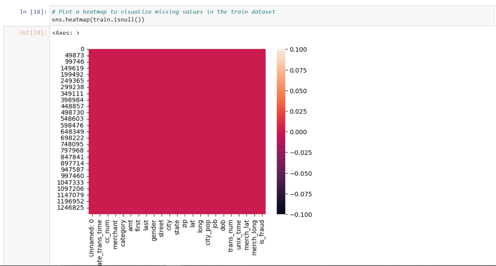
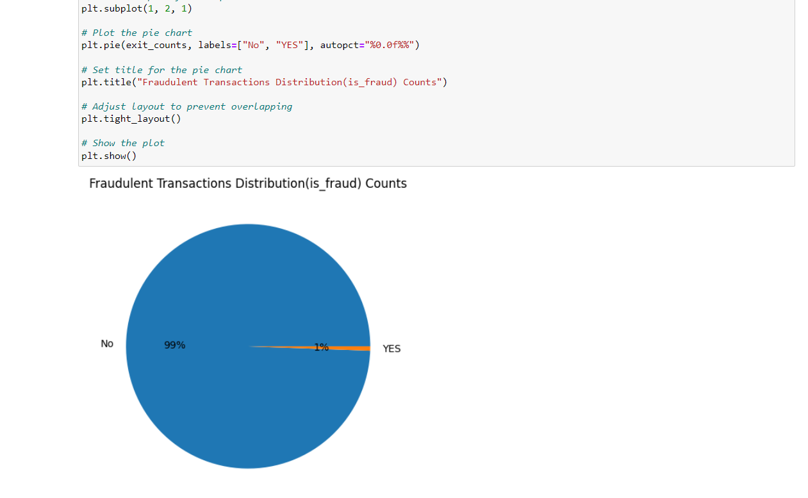
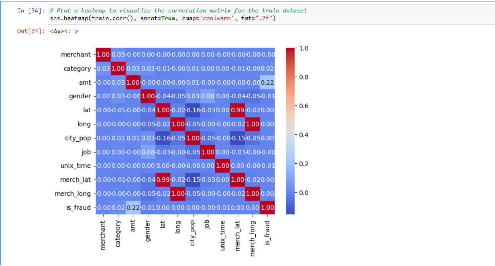

## Introduction

Credit card fraud is a significant issue in the financial industry. This project explores the use of machine learning algorithms to detect fraudulent transactions. We use Logistic Regression, Random Forest, and Decision Tree classifiers to build predictive models.

## Dataset

The dataset used in this project is the [https://drive.google.com/drive/folders/1sDzIPjCmNZ9lWaXfcAqIIx4NZchYG4OP?usp=drive_link]. This is a simulated credit card transaction dataset containing legitimate and fraud transactions from the
 duration 1st Jan 2019 - 31st Dec 2020. It covers credit cards of 1000 customers doing transactions with a pool of 800 merchants.

## Models

### Logistic Regression
A simple and interpretable linear model used for binary classification.

### Random Forest
An ensemble method that builds multiple decision trees and merges them to get a more accurate and stable prediction.

### Decision Tree
A model that uses a tree-like graph of decisions and their possible consequences.

## Screenshots

## Results

The performance of each model is evaluated using metrics such as accuracy  Below is a summary of the results:

    Algorithm	          Accuracy
    LogisticRegression	 0.994139
    RandomForestClassifier	 0.997424
   	DecisionTreeClassifier	 0.995866
  
